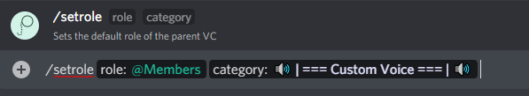
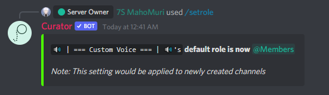
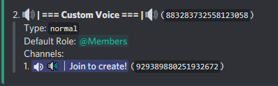

# setRole

#### Command Examples:

```fix
/setrole <@role> <#category>
```

#### Arguments:

- **`@role`** - The role to set as default.
- **`#category`** - The category whose default role to change.

#### Description:

This command will set the default role of the Custom voice channel. By default the role is set to **`@everyone`**, you can check this by running the [**`/settings`**](settings.md) command.






