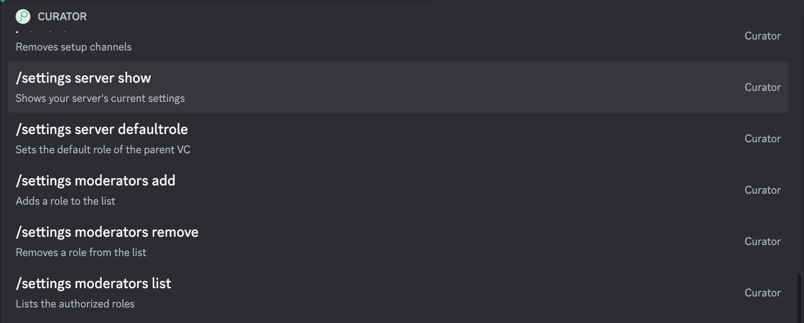

# settings _re-invented!_

#### Command Examples:

```fix
/settings <subcommand> <argument>
```

#### Subcommands:

- server
- moderator

#### Arguments:

- server:
  - `show` - Shows the current server settings
  - `defaultrole <@role>` - Sets the default role for a certain channel
- moderator:
  - `add <@role>` - Adds a role to moderators list.
  - `remove <@role>` - Removes a role from the moderators list.
  - `list` - Shows the current list of moderator roles.

#### Description:

The server command has been re-invented and a couple of new functions!

It now has the ability to add certain roles to a list the can access admin commands and is no longer limited to the `Administrator` or the `ManageGuilds` permission.

You can also view the general server settings like before. You can do so by type `/settings server show`. The `setRole` command was moved to this command and was renamed to `defaultrole` under the server subcommand. It works exactly like before it was simply moved under this command.


