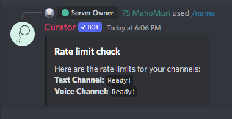
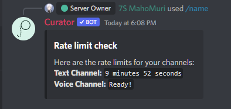

# name

#### Command Examples:

```fix
/name both <channelName>
/name text <channelName>
/name voice <channelName>
/name check
```

#### Arguments:

- **`both`** - Changes both the text and voice channel
- **`text`** - Changes the text channel
- **`voice`** - Changes the voice channel
- **`check`** - Checks wether your channel can be edited or not
- **`channelName`** - The new name for the channel

#### Description:

Changes the name of the voice or text channel.

 **Note:** You can only edit a specific channel twice every `10 minutes`. This is due to Discord's rate limits and has nothing to do with Curator.


If you want to check your rate limits, you can simply run the **`/name check`** command. This would display either an all channels are ready for editing or not.

Example:



Fig. 1 An example if both channels are ready to edit.



Fig. 2 An example if one of the channels has a timer
